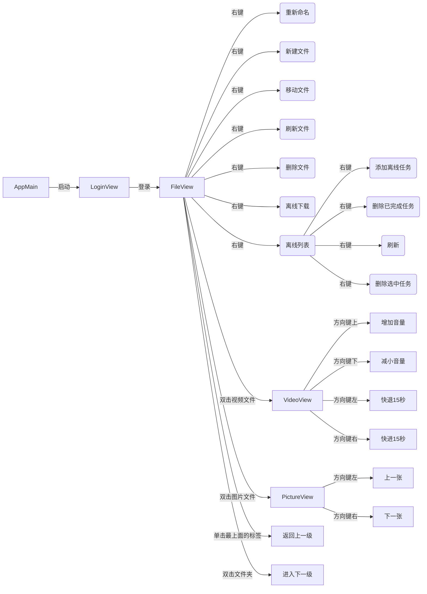

# SixPan

用java写的[6盘](https://v3-beta.6pan.cn/)GUI客户端

## 使用

```bash
git clone git@github.com:zerorooot/SixPan.git
cd SixPan
mvn assembly:assembly
java -jar target/SixPan-1.0-jar-with-dependencies.jar
```


## 目前支持的功能

1. 登录
2. 文件浏览
3. 返回上层目录(点击最上面的lable)
4. 添加离线下载连接
5. 查看离线下载列表
6. 图片浏览
7. 视频浏览(需要安装vlc)
8. 增删改移文件(右键弹出)

流程



## 项目目录

```bash
.
├── LICENSE
├── README.md
├── pom.xml
└── src
    ├── main
    │   ├── java
    │   │   └── com
    │   │       └── github
    │   │           └── zerorooot
    │   │               ├── AppMain.java
    │   │               ├── bean
    │   │               │   ├── ApiUrl.java
    │   │               │   ├── FileBean.java
    │   │               │   ├── OffLineBean.java
    │   │               │   ├── TableCheckBox.java
    │   │               │   └── TokenBean.java
    │   │               ├── control
    │   │               │   ├── FileControl.java
    │   │               │   └── LoginControl.java
    │   │               ├── serve
    │   │               │   ├── FileServe.java
    │   │               │   └── LoginServe.java
    │   │               ├── util
    │   │               │   └── PropertiesUtil.java
    │   │               └── view
    │   │                   ├── FileView.java
    │   │                   ├── LoginView.java
    │   │                   ├── OffLineAddView.java
    │   │                   ├── OffLineTableView.java
    │   │                   ├── PictureView.java
    │   │                   └── VideoView.java
    │   └── resources
    │       └── OffLineAddView.fxml
    └── test
        └── java
```

